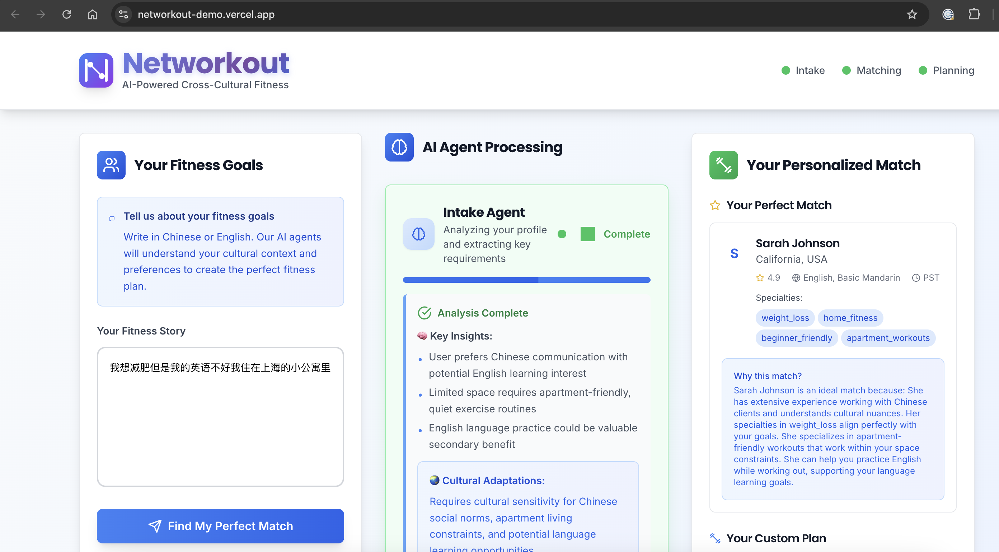
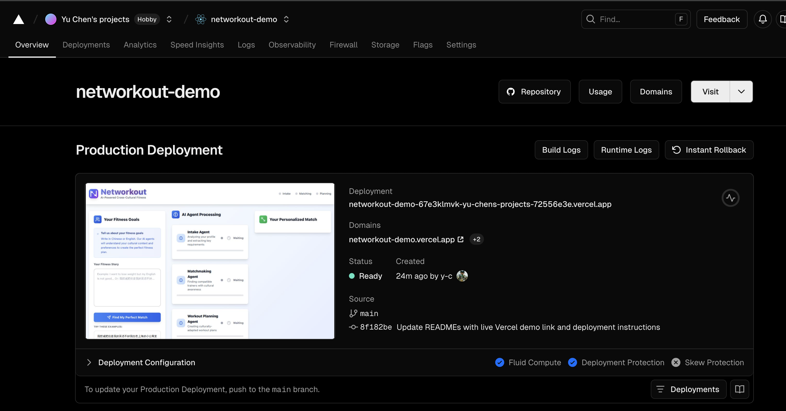

# 🏋️ Networkout: AI-Powered Cross-Cultural Fitness Networking

## 🚀 Live Demo
**[Try Networkout Live →](https://networkout-demo.vercel.app/)**

## 📸 Screenshots




## 🎯 The Perfect Market Mismatch

### 🇨🇳 China: Massive Demand
- 📈 **$28.4B fitness market** growing 9.17% annually
- 🏢 **Educated urban professionals** in tier-1 cities
- 💰 **High disposable income** + English learning aspirations
- ❌ **Quality trainer shortage** - most are sales-focused

### 🇺🇸 US: Untapped Supply
- 🎓 **Millions of college students** with fitness knowledge
- 💵 **Need flexible income** to pay bills
- 🕐 **Available during Chinese evening** hours
- 🔓 **Undermonetized expertise** in fitness & sports science

### 💡 No platform connects these markets with cultural intelligence

## 🤖 Our Solution: Autonomous AI Agents
We built an AI-powered platform with three autonomous agents that work together:

### 1. **Intake Agent** 
- Analyzes user input in natural language (English/Chinese)
- Extracts fitness goals, dietary restrictions, and preferences
- Creates comprehensive user profile

### 2. **Matchmaking Agent**
- Matches based on cultural compatibility
- Considers language preferences, dietary understanding
- Ranks trainers by cultural awareness score

### 3. **Workout Planning Agent**
- Generates culturally-adapted workout plans
- Accommodates dietary restrictions (halal, vegetarian, etc.)
- Provides bilingual instructions when needed

## 🎬 Quick Demo Setup

### Option 1: View Live Demo
Visit our deployed demo at **[https://your-vercel-url.vercel.app](https://your-vercel-url.vercel.app)**

### Option 2: Run Locally
```bash
# Clone the repo
git clone https://github.com/y-c/networkout-demo
cd networkout-demo

# Install dependencies
npm install

# Add your OpenAI API key to .env
echo "REACT_APP_OPENAI_API_KEY=your_key_here" > .env

# Start the demo
npm start
```

### Option 3: Deploy Your Own
```bash
# Install Vercel CLI
npm i -g vercel

# Deploy to Vercel (free)
vercel

# Follow the prompts - your demo will be live in ~2 minutes!
```

## 🏆 Why Networkout Wins
✅ **Autonomous Decision Making** - Agents operate independently with transparent reasoning  
✅ **Cultural Bridge** - First platform designed for cross-cultural fitness  
✅ **Scalable Architecture** - Can expand to any cultural pairing  
✅ **Real Problem** - Validated need in both markets  

## 🛠️ Technical Details
- Built in 5 hours using React, Node.js, and OpenAI GPT-4
- Autonomous agent architecture with visible reasoning
- **[View Full Technical Documentation →](public/TECHNICAL_README.md)**

---
*Built for Agentic Workflows Track - Autonomous agents that think, act, and execute*